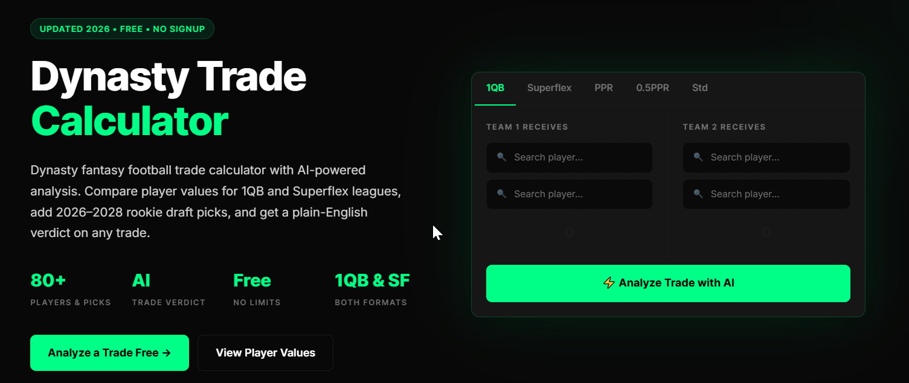
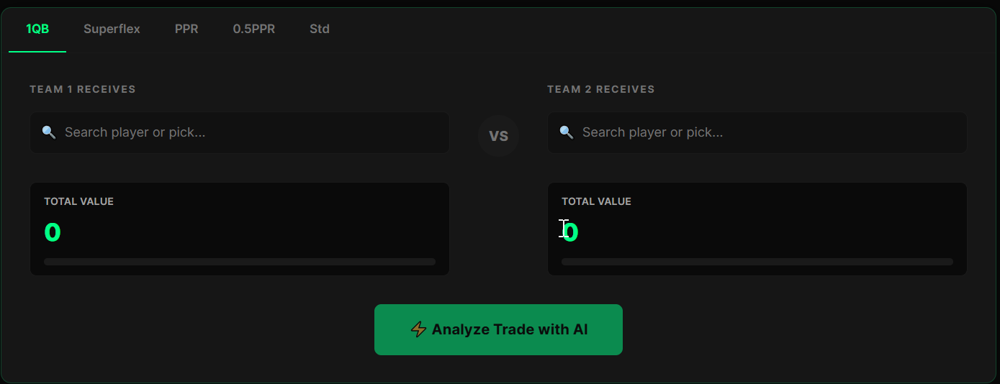

# 🏈 DynastyTradeHQ

Free AI-powered Dynasty Fantasy Football Trade Calculator, Trade Value Charts, Player Values, and Dynasty Rankings.

DynastyTradeHQ helps dynasty fantasy football managers evaluate trades using player values, rookie draft pick values, and AI-powered trade analysis. Compare trades instantly for both **1QB** and **Superflex** dynasty leagues—completely free with no signup required.

## 🌐 Website

**https://dynastytradehq.com**

---

## ✨ Features

- 🤖 AI-powered Trade Analysis
- 🏈 Dynasty Fantasy Football Trade Calculator
- 📊 Dynasty Trade Value Chart
- 👤 Individual Player Value Pages
- 🎯 Rookie Draft Pick Values (2026–2028)
- ⚡ Supports 1QB & Superflex Leagues
- 🆓 Free to Use – No Signup Required
- 📚 Dynasty Fantasy Football Strategy Blog

---

## 📸 Screenshots

### Homepage

### AI Trade Calculator

---

## 🔗 Resources

| Resource | URL |
|----------|-----|
| 🏈 Trade Calculator | https://dynastytradehq.com |
| 👤 Player Values | https://dynastytradehq.com/player-values |
| 📋 Player Pages | https://dynastytradehq.com/players |
| 📰 Dynasty Blog | https://dynastytradehq.com/blog |

---

## 🚀 Why DynastyTradeHQ?

DynastyTradeHQ combines expert player values with AI-powered trade analysis to help dynasty fantasy football managers make smarter trade decisions. Whether you're rebuilding your roster or competing for a championship, our tools provide fast, data-driven insights to evaluate every trade with confidence.

---

## 🛠️ Built With

- Next.js
- React
- Tailwind CSS
- JavaScript
- Vercel

---

## 📢 Disclaimer

This repository contains **public documentation only**. The production application and source code for DynastyTradeHQ are private.

---

## 📄 License

Copyright © 2026 DynastyTradeHQ. All Rights Reserved.
